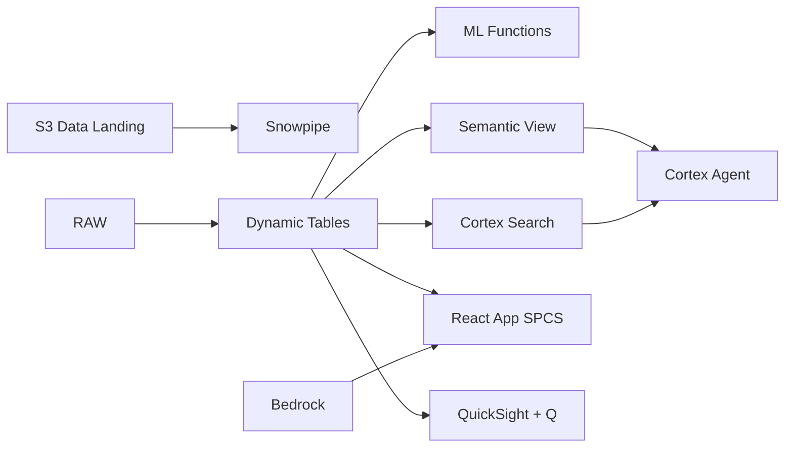

# Supply Chain Traceability

Mill-to-port traceability for Malaysian palm oil — Dynamic Tables build chain-of-custody, Iceberg enables auditor self-service via Athena, and Row Access Policies enforce buyer-level data segregation.

## Architecture

A major Malaysian palm oil group operates 100 mills sourcing from 500 plantation suppliers across Peninsular Malaysia, Sabah, and Sarawak. International buyers like Unilever, Nestlé, and Wilmar require full plantation-to-port traceability and NDPE compliance proof. Eight mills are below the 95% traceability threshold, and mass balance reconciliation flags 3 mills with suspicious variance. Auditors need self-service access without a Snowflake license.



## Snowflake Capabilities

| Capability | Implementation |
|-----------|---------------|
| Dynamic Tables | FULL_CHAIN_OF_CUSTODY / MILL_TRACEABILITY_SCORE / BUYER_SUPPLY_CHAIN_VIEW / MASS_BALANCE_RECONCILIATION |
| ML Functions | ML.ANOMALY_DETECTION |
| Cortex AI | AI_PARSE_DOCUMENT, SUMMARIZE, AI_CLASSIFY |
| Cortex Search | 200 documents indexed |
| Cortex Agent | TRACEABILITY_AGENT |
| Semantic View | TRACEABILITY_ANALYTICS |
| React App (SPCS) | 5 tabs + DemoGuide |


## AWS Services

| Service | Role in Demo |
|---------|-------------|
| Amazon S3 | Store audit reports, certification documents, and Iceberg table data |
| Apache Iceberg (on S3) | Open table format for auditor self-service access |
| AWS Glue | Catalog and transform supply chain data for Athena queries |
| AWS Lake Formation | Fine-grained access control for buyer-level data segregation |
| Amazon Bedrock (Claude) | Summarize audit findings and generate compliance narratives |
| Amazon QuickSight + Q | Supply chain visibility dashboard with natural language queries |


## Personas

| Persona | Role | Key Questions |
|---------|------|---------------|
| **Puan Rosnah binti Abdullah** | VP Supply Chain | "What percentage of our volume is traceable to plantation?" "Which mills have incomplete chain-of-custody?" |
| **James Ong** | Traceability Auditor | "Show me the chain-of-custody for shipment SHP-2024-0847." "Which mills failed mass balance reconciliation?" |


## Data

| Table | Rows | Description |
|-------|------|-------------|
| MILLS | 100 | Palm oil mills with GPS coordinates, capacity, and certification status |
| SHIPMENTS | 20,000 | CPO and CPKO shipments from mill to refinery to port |
| CHAIN_OF_CUSTODY | 50,000 | Custody transfer records linking plantation to mill to buyer |
| CERTIFICATIONS | 3,000 | RSPO, MSPO, ISCC, and NDPE certifications per mill and supplier |
| AUDIT_REPORTS | 200 | Third-party audit reports, mass balance reconciliations, and findings |
| BUYERS | 30 | International buyers with sustainability requirements and data access scope |
| PLANTATION_SUPPLIERS | 500 | Smallholders and estate suppliers feeding into each mill |


## Build Instructions

### Prerequisites
- Snowflake account with ACCOUNTADMIN access
- Cortex AI enabled (ML Functions, Search, Agent)
- Warehouse: TRACEABILITY_WH (Medium)
- AWS CLI with access (us-west-2)

### Deployment

```bash
snowsql -f snowflake/00_setup.sql
snowsql -f snowflake/01_marketplace_install.sql
snowsql -f snowflake/02_raw_tables.sql
snowsql -f snowflake/03_staging.sql
snowsql -f snowflake/04_dynamic_tables.sql
snowsql -f snowflake/05_search.sql
snowsql -f snowflake/06_ml_models.sql
snowsql -f snowflake/07_semantic_view.sql
snowsql -f snowflake/08_agent.sql
```

### React App (SPCS)
```bash
cd app && npm ci && npm run build
docker build -t aws-malaysia-palm-oil-traceability-app .
docker push bdiqc8sm-default.registry.snowflakecomputing.com/palm_oil_traceability/app/aws_malaysia_palm_oil_traceability/app:latest
```

### Demo Mode
Open the app URL with `?demo=true` for presenter view.

## Build Modes

### Snowflake Only
Run scripts 00-08 (skip AWS-specific integration). Uses:
- **Snowflake Internal Stage + Iceberg Tables** instead of Amazon S3
- **Snowflake-managed Iceberg Tables** instead of Apache Iceberg (on S3)
- **Dynamic Tables** instead of AWS Glue
- **Row Access Policies** instead of AWS Lake Formation
- **Cortex Complete** instead of Amazon Bedrock (Claude)
- **Snowflake Intelligence (Cortex Analyst)** instead of Amazon QuickSight + Q

### Full AWS + Snowflake
Run all scripts including AWS integration. Deploy QuickSight dashboard from `quicksight/`.

## Business Impact

Industry research and Snowflake customer outcomes:
- **86% of global palm oil buyers now require full traceability to plantation level** — [CDP Forests](https://www.cdp.net/en/forests)
- **RSPO-certified traceable palm oil commands 8-12% price premium over non-traceable** — [RSPO](https://rspo.org/impact/)
- **Malaysia's MSPO mandatory certification covers 94% of planted area as of 2023** — [MPOCC](https://www.mpocc.org.my/)
- **Supply chain traceability reduces fraud risk by 45% and improves buyer confidence scores** — [Deloitte Supply Chain](https://www.deloitte.com/us/en/services/consulting/supply-chain-and-network-operations.html)
- **Honeywell** (Snowflake customer): connects 500K+ machines on Snowflake, enabling precision agriculture analytics across 400M+ acres globally -- [snowflake.com/customers/honeywell](https://www.snowflake.com/en/customers/all-customers/video/honeywell/)

## Key Demo Numbers

- **100 mills** tracked across Peninsular, Sabah, and Sarawak
- **50,000 records** chain-of-custody entries maintained in real-time
- **99.2% traceable** volume traceable to plantation level
- **RM 8.9B** traced export volume this year
- **200 audit reports** searchable via Cortex Search
- **8 mills** below 95% traceability threshold
- **3 mills** flagged for mass balance variance >5%


## License

Apache 2.0 — See [LICENSE](LICENSE) for details.

This is a personal demo project and is not an official Snowflake offering. It comes with no support or warranty.